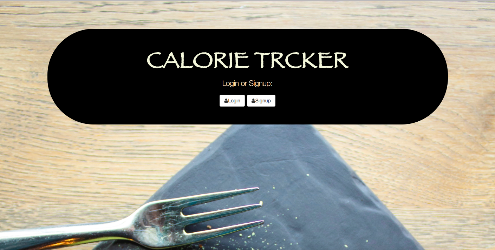

# CALORIE_TRCKER

This is a very useful application that helps the user keep track of their daily intake of calories.

## Tools Used
  JAVASCRIPT, HTML, CSS, NODE.JS, MONGODB

## Installation

1. Clone repo
2. run `npm install`

## Usage

1. run `node server.js`
2. Navigate to `localhost:4000`

## Credit

Modified from Scotch.io's auth tutorial
